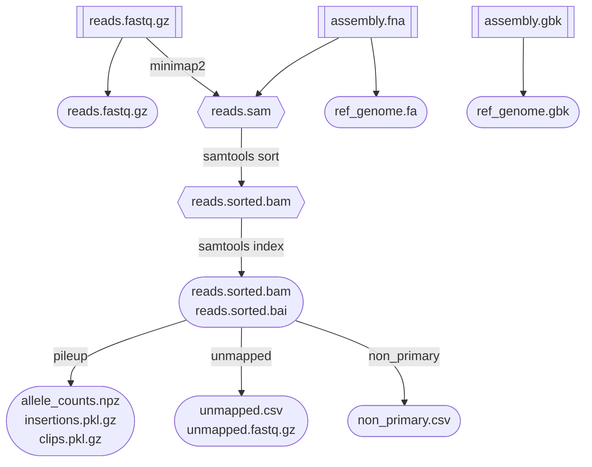

# Pipeline description

Legend:


## Pileup

This workflow maps the reads against a reference genome. It further analyzes the mapped reads by building a pileup and a list of insertions and clips.

### workflow overview

The input files must be organized in the input directory with a nested `vial_XX/time_YY/` folder structure:

```
input_dir/vial_XX/time_YY/
├── assembled_genome
│   ├── assembly.fna
│   └── assembly.gbk
└── reads.fastq.gz
```

Assembled genomes have to be present only for the first timepoint. For each of these vials and timepoints the workflow performs the following operations:



The output files are saved, using the same `vial_XX/time_YY` nested folder structure in the `results/input_dir_basename` folder.

### input/output files description

**Input files**
- `reads.fastq.gz`: fastq file containing all the reads.
- `assembly.fna`: fasta file containing one entry corresponding to the assembled genome
- `assembly.gbk`: genbank file 

**Output files**
- `ref_genome.{fa,gbk}`: symlink to the assembled genome files, saved in the output folder for convenient use in other downstream analyses
- `reads.sorted.{bam,bam.bai}`: mapped and sorted reads, and corresponding index.
- `allele_counts.npz`: numpy tensor containing the pileup. It has shape `(2,6,L)` where `L` is the length of the genomes. Dimensions indicate `fwd/rev`, `A,C,G,T,-,N`, and position. For each index the tensor contains number of observations.
- `insertions.pkl.gz`: dictionary of the form `{ position -> { seq -> [#fwq, #rev ]}}` with the number of forward/reverse insertions, grouped by inserted sequence, per position.
- `clips.pkl.gz`: dictionary with two keys: `count` and `seqs`.
  - `count` contains a dictionary `{ position -> [#clip fwd, #clip rev, #start/end fwd, #start/end rev]}`, where the last two entries save any position where a clip is inserted.
  - `seqs` contains a nested dictionary `{ position -> 0/1 for fwd/rev -> [ soft-clipped seqs ] }`.
- `unmapped.{csv,fastq.gz}`: dataframe with list of unmapped reads. It contains the read-id, length, flag and average quality. The fastq.gz file contains these reads.
- `non_primary.csv`: dataframe with list of mapping info for reads that have *supplementary* or *secondary* mappings. The primary one is included too. The structure of this file is described [here](read_mapping.md).


## Extract Stats

### input/output files

**Output files:**

- `stats_table_{stat-id}_freq.pkl.gz`, where `stat-id` is either `gap` or `reference`. These are pandas dataframes with the following entries:
  - `position` : reference genome position.
  - `type` : either `fwd` or `rev` or `tot`.
  - `freq_{t}`, where `t` is the timepoint: consensus or gap frequency at the given position, and for `fwd`, `rev` or `tot` reads.
  - `N_{t}`, where `t` is the timepoint: total number of observations at the given position, and for `fwd`, `rev` or `tot` reads.

## Plots

produced plots are described in `plots.md`.